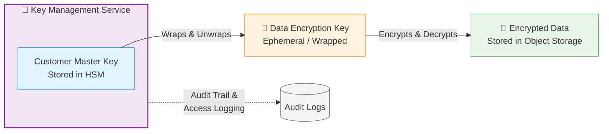

<p align="center">
  
</p>


# 🧭 Cloud KMS Masterclass (AWS · Azure · GCP)
_A multi-cloud encryption journey — from zero to hero._

---

## 🎓 Welcome to the Masterclass
Keys are the **crown jewels of cloud security** — and you’re about to become the **keysmith**.  
This course takes you from KMS beginner to **multi-cloud encryption architect** by mastering:

- 🔐 **AWS KMS**
- 🏦 **Azure Key Vault / Managed HSM**
- ☁️ **Google Cloud KMS / External Key Manager**

Each day includes: deep theory, CLI & IaC, diagrams, cloud-native verification, and a quiz/anki set.

---

## 🗺️ 10-Day Roadmap

| Day | Provider | Title | Link |
|-----|-----------|--------|------|
| 1 | 🟧 AWS | S3 + EBS with Customer-Managed Key | [🔗 View Lab](day-by-day/day1-aws-beginner.md) |
| 2 | 🟦 Azure | Blob Storage Encryption with AKV CMK | [🔗 View Lab](day-by-day/day2-azure-beginner.md) |
| 3 | 🟨 GCP | BigQuery CMEK + Cloud Storage Encryption | [🔗 View Lab](day-by-day/day3-gcp-beginner.md) |
| 4 | 🟧 AWS | CMK Rotation + Aliases Automation | [🔗 View Lab](day-by-day/day4-aws-intermediate.md) |
| 5 | 🟦 Azure | Managed HSM + Disk Encryption Sets | 🚧 Coming soon |
| 6 | 🟨 GCP | External Key Manager (EKM) Integration | 🚧 Coming soon |
| 7 | ☁️ Cross-Cloud | Cross-Account / Cross-Cloud BYOK | 🚧 Coming soon |
| 8 | ☁️ Cross-Cloud | Envelope Encryption Deep Dive | 🚧 Coming soon |
| 9 | ☁️ Cross-Cloud | Key Governance, RBAC, Audit | 🚧 Coming soon |
| 10 | ☁️ Capstone | Unified KMS Security Dashboard | 🚧 Coming soon |
---

## 🧩 Repository Map
```plaintext
cloud-kms-masterclass/
├── README.md
├── day-by-day/
│   ├── day1-aws-beginner.md
│   ├── day2-azure-beginner.md
│   └── day3-gcp-beginner.md
├── docs/
│   ├── aws/
│   ├── azure/
│   ├── gcp/
│   └── cross-cloud/
├── common/
│   ├── diagrams/
│   └── scripts/
└── anki/
🧠 Encryption Mental Model
Think of KMS as a digital vault. The master key (CMK) never leaves the vault.
Workloads get a temporary data key (DEK) to encrypt data; that DEK is then encrypted with your CMK — envelope encryption.



🧱 Automation Stack
🐍 CLI / SDK: AWS CLI · Azure CLI · gcloud

⚙️ IaC: Terraform · CloudFormation · Bicep

🔒 Security: Least Privilege · RBAC · CMK Isolation

🧾 Auditing: CloudTrail · Activity Logs · Audit Logs

🧠 Study Tip
“Encryption without key mastery is illusion — this course makes you the keysmith.” 🔐

Commit as you complete each day:

bash
Copy code
git add .
git commit -m "feat: complete dayX lab"
git push
<p align="center">💥 <b>Let’s roll — your journey to KMS mastery begins here.</b> 🚀</p> ```
