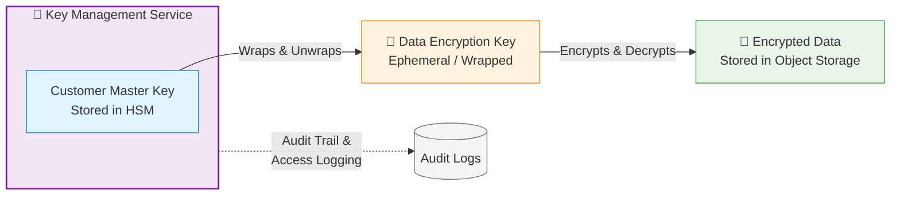

<p align="center">
  
</p>


# 🧭 Cloud KMS Masterclass (AWS · Azure · GCP)
_A multi-cloud encryption journey — from zero to hero._

---

## 🎓 Welcome to the Masterclass
Keys are the **crown jewels of cloud security** — and you’re about to become the **keysmith**.  
This course takes you from KMS beginner to **multi-cloud encryption architect** by mastering:

- 🔐 **AWS KMS**
- 🏦 **Azure Key Vault / Managed HSM**
- ☁️ **Google Cloud KMS / External Key Manager**

Each day includes: deep theory, CLI & IaC, diagrams, cloud-native verification, and a quiz/anki set.

---

## 🗺️ 10-Day Roadmap

<!-- Course Dashboard Cards -->
<div align="center" style="display:grid; gap:14px; grid-template-columns: repeat(auto-fit, minmax(260px, 1fr));">

  <!-- Day 1 -->
  <a href="day-by-day/day1-aws-beginner.md" style="text-decoration:none;">
    <div style="border:1px solid #e5e7eb; border-radius:14px; padding:16px; background:#fff; box-shadow:0 2px 6px rgba(0,0,0,0.06);">
      <div style="font-size:28px;">🟧</div>
      <div style="font-weight:700; font-size:18px; margin-top:6px;">Day 1 — AWS</div>
      <div style="color:#374151; margin-top:4px;">S3 + EBS with Customer-Managed Key</div>
      <div style="margin-top:10px; font-weight:600; color:#0ea5e9;">🔗 View Lab</div>
    </div>
  </a>

  <!-- Day 2 -->
  <a href="day-by-day/day2-azure-beginner.md" style="text-decoration:none;">
    <div style="border:1px solid #e5e7eb; border-radius:14px; padding:16px; background:#fff; box-shadow:0 2px 6px rgba(0,0,0,0.06);">
      <div style="font-size:28px;">🟦</div>
      <div style="font-weight:700; font-size:18px; margin-top:6px;">Day 2 — Azure</div>
      <div style="color:#374151; margin-top:4px;">Blob Storage Encryption with AKV CMK</div>
      <div style="margin-top:10px; font-weight:600; color:#0ea5e9;">🔗 View Lab</div>
    </div>
  </a>

  <!-- Day 3 -->
  <a href="day-by-day/day3-gcp-beginner.md" style="text-decoration:none;">
    <div style="border:1px solid #e5e7eb; border-radius:14px; padding:16px; background:#fff; box-shadow:0 2px 6px rgba(0,0,0,0.06);">
      <div style="font-size:28px;">🟨</div>
      <div style="font-weight:700; font-size:18px; margin-top:6px;">Day 3 — GCP</div>
      <div style="color:#374151; margin-top:4px;">BigQuery CMEK + Cloud Storage Encryption</div>
      <div style="margin-top:10px; font-weight:600; color:#0ea5e9;">🔗 View Lab</div>
    </div>
  </a>

  <!-- Day 4 -->
  <a href="day-by-day/day4-aws-intermediate.md" style="text-decoration:none;">
    <div style="border:1px solid #e5e7eb; border-radius:14px; padding:16px; background:#fff; box-shadow:0 2px 6px rgba(0,0,0,0.06);">
      <div style="font-size:28px;">🟧</div>
      <div style="font-weight:700; font-size:18px; margin-top:6px;">Day 4 — AWS</div>
      <div style="color:#374151; margin-top:4px;">CMK Rotation + Aliases Automation</div>
      <div style="margin-top:10px; font-weight:600; color:#0ea5e9;">🔗 View Lab</div>
    </div>
  </a>

  <!-- Day 5 (coming) -->
  <a href="day-by-day/day5-azure-intermediate.md" style="text-decoration:none;">
    <div style="border:1px solid #e5e7eb; border-radius:14px; padding:16px; background:#f8fafc; box-shadow:0 2px 6px rgba(0,0,0,0.04);">
      <div style="font-size:28px;">🟦</div>
      <div style="font-weight:700; font-size:18px; margin-top:6px;">Day 5 — Azure</div>
      <div style="color:#374151; margin-top:4px;">Managed HSM + Disk Encryption Sets</div>
      <div style="margin-top:10px; font-weight:600; color:#0ea5e9;">🔗 View Lab</div>
    </div>
  </a>

  <!-- Day 6 -->
  <div style="border:1px dashed #e5e7eb; border-radius:14px; padding:16px; background:#fafafa;">
    <div style="font-size:28px;">🟨</div>
    <div style="font-weight:700; font-size:18px; margin-top:6px;">Day 6 — GCP</div>
    <div style="color:#6b7280; margin-top:4px;">External Key Manager (EKM) Integration</div>
    <div style="margin-top:10px; font-weight:600; color:#9ca3af;">🚧 Coming soon</div>
  </div>

  <!-- Day 7 -->
  <div style="border:1px dashed #e5e7eb; border-radius:14px; padding:16px; background:#fafafa;">
    <div style="font-size:28px;">☁️</div>
    <div style="font-weight:700; font-size:18px; margin-top:6px;">Day 7 — Cross-Cloud</div>
    <div style="color:#6b7280; margin-top:4px;">Cross-Account / Cross-Cloud BYOK</div>
    <div style="margin-top:10px; font-weight:600; color:#9ca3af;">🚧 Coming soon</div>
  </div>

  <!-- Day 8 -->
  <div style="border:1px dashed #e5e7eb; border-radius:14px; padding:16px; background:#fafafa;">
    <div style="font-size:28px;">☁️</div>
    <div style="font-weight:700; font-size:18px; margin-top:6px;">Day 8 — Cross-Cloud</div>
    <div style="color:#6b7280; margin-top:4px;">Envelope Encryption Deep Dive</div>
    <div style="margin-top:10px; font-weight:600; color:#9ca3af;">🚧 Coming soon</div>
  </div>

  <!-- Day 9 -->
  <div style="border:1px dashed #e5e7eb; border-radius:14px; padding:16px; background:#fafafa;">
    <div style="font-size:28px;">☁️</div>
    <div style="font-weight:700; font-size:18px; margin-top:6px;">Day 9 — Cross-Cloud</div>
    <div style="color:#6b7280; margin-top:4px;">Key Governance, RBAC, Audit</div>
    <div style="margin-top:10px; font-weight:600; color:#9ca3af;">🚧 Coming soon</div>
  </div>

  <!-- Day 10 -->
  <div style="border:1px dashed #e5e7eb; border-radius:14px; padding:16px; background:#fafafa;">
    <div style="font-size:28px;">☁️</div>
    <div style="font-weight:700; font-size:18px; margin-top:6px;">Day 10 — Capstone</div>
    <div style="color:#6b7280; margin-top:4px;">Unified Multi-Cloud KMS Security Dashboard</div>
    <div style="margin-top:10px; font-weight:600; color:#9ca3af;">🚧 Coming soon</div>
  </div>

</div>

---

## 🧩 Repository Map
```plaintext
cloud-kms-masterclass/
├── README.md
├── day-by-day/
│   ├── day1-aws-beginner.md
│   ├── day2-azure-beginner.md
│   └── day3-gcp-beginner.md
├── docs/
│   ├── aws/
│   ├── azure/
│   ├── gcp/
│   └── cross-cloud/
├── common/
│   ├── diagrams/
│   └── scripts/
└── anki/
🧠 Encryption Mental Model
Think of KMS as a digital vault. The master key (CMK) never leaves the vault.
Workloads get a temporary data key (DEK) to encrypt data; that DEK is then encrypted with your CMK — envelope encryption.



🧱 Automation Stack
🐍 CLI / SDK: AWS CLI · Azure CLI · gcloud

⚙️ IaC: Terraform · CloudFormation · Bicep

🔒 Security: Least Privilege · RBAC · CMK Isolation

🧾 Auditing: CloudTrail · Activity Logs · Audit Logs

🧠 Study Tip
“Encryption without key mastery is illusion — this course makes you the keysmith.” 🔐

Commit as you complete each day:

bash
Copy code
git add .
git commit -m "feat: complete dayX lab"
git push
<p align="center">💥 <b>Let’s roll — your journey to KMS mastery begins here.</b> 🚀</p> ```
