<p align="center">
  
</p>


# 🧭 Cloud KMS Masterclass (AWS · Azure · GCP)
_A multi-cloud encryption journey — from zero to hero._

---

## 🎓 Welcome to the Masterclass
Keys are the **crown jewels of cloud security** — and you’re about to become the **keysmith**.  
This course takes you from KMS beginner to **multi-cloud encryption architect** by mastering:

- 🔐 **AWS KMS**
- 🏦 **Azure Key Vault / Managed HSM**
- ☁️ **Google Cloud KMS / External Key Manager**

Each day includes: deep theory, CLI & IaC, diagrams, cloud-native verification, and a quiz/anki set.

---

## 🗺️ 10-Day Roadmap

| Day | Provider | Title | Link |
|:--:|:--:|---|---|
| **1** | 🟧 | S3 + EBS with Customer-Managed Key | [🔗 View Lab](day-by-day/day1-aws-beginner.md) |
| **2** | 🟦 | Blob Storage Encryption with AKV CMK | [🔗 View Lab](day-by-day/day2-azure-beginner.md) |
| **3** | 🟨 | BigQuery CMEK + Cloud Storage Encryption | 🚧 _Coming soon_ |
| **4** | 🟧 | CMK Rotation + Aliases Automation | 🚧 _Coming soon_ |
| **5** | 🟦 | Managed HSM + Disk Encryption Sets | 🚧 _Coming soon_ |
| **6** | 🟨 | External Key Manager (EKM) Integration | 🚧 _Coming soon_ |
| **7** | ☁️ | Cross-Account / Cross-Cloud BYOK | 🚧 _Coming soon_ |
| **8** | ☁️ | Envelope Encryption Deep Dive | 🚧 _Coming soon_ |
| **9** | ☁️ | Key Governance, RBAC, Audit | 🚧 _Coming soon_ |
| **10** | ☁️ | Capstone: Unified KMS Security Dashboard | 🚧 _Coming soon_ |

---

## 🧩 Repository Map
```plaintext
cloud-kms-masterclass/
├── README.md
├── day-by-day/
│   ├── day1-aws-beginner.md
│   ├── day2-azure-beginner.md
│   └── day3-gcp-beginner.md
├── docs/
│   ├── aws/
│   ├── azure/
│   ├── gcp/
│   └── cross-cloud/
├── common/
│   ├── diagrams/
│   └── scripts/
└── anki/
🧠 Encryption Mental Model
Think of KMS as a digital vault. The master key (CMK) never leaves the vault.
Workloads get a temporary data key (DEK) to encrypt data; that DEK is then encrypted with your CMK — envelope encryption.

```mermaid
%%{init: {'theme':'base'}}%%
flowchart LR
    subgraph Vault["🔐 Key Management Service"]
        CMK["Customer Master Key<br/>Stored in HSM"]
    end
    
    DEK["📄 Data Encryption Key<br/>Ephemeral / Wrapped"]
    Data["💾 Encrypted Data<br/>Stored in Object Storage"]
    
    CMK -->|Wraps & Unwraps| DEK
    DEK -->|Encrypts & Decrypts| Data
    
    Vault -.->|Audit Trail &<br/>Access Logging| Audit[(Audit Logs)]
    
    style Vault fill:#f3e5f5,stroke:#7b1fa2,stroke-width:2px
    style CMK fill:#e1f5fe,stroke:#0288d1
    style DEK fill:#fff3e0,stroke:#f57c00
    style Data fill:#e8f5e8,stroke:#388e3c
    style Audit fill:#f5f5f5,stroke:#757575
```



🧱 Automation Stack
🐍 CLI / SDK: AWS CLI · Azure CLI · gcloud

⚙️ IaC: Terraform · CloudFormation · Bicep

🔒 Security: Least Privilege · RBAC · CMK Isolation

🧾 Auditing: CloudTrail · Activity Logs · Audit Logs

🧠 Study Tip
“Encryption without key mastery is illusion — this course makes you the keysmith.” 🔐

Commit as you complete each day:

bash
Copy code
git add .
git commit -m "feat: complete dayX lab"
git push
<p align="center">💥 <b>Let’s roll — your journey to KMS mastery begins here.</b> 🚀</p> ```
