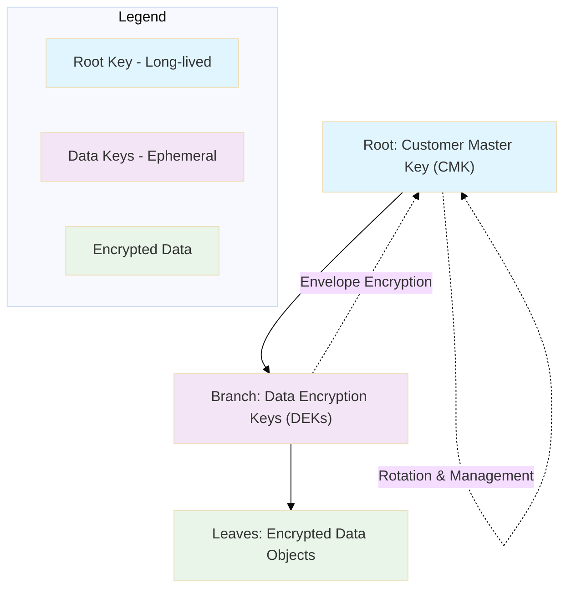

<p align="center">
  
</p>

# ☁️ Day 3 — GCP Cloud KMS (Beginner): Cloud Storage + BigQuery with CMEK  
_A cryptographic journey through Google’s vault of digital secrets._

---

## 🌳 The Great Tree of Digital Secrets

Every encryption system is like a **tree** — its **roots** hold the **master keys**, its **branches** carry **service keys**, and its **leaves** secure **data objects**.



Branches (DEK) – temporary, per-object keys

Leaves (Data) – encrypted files, rows, or blobs

🏰 The Castle Analogy — Understanding Key Hierarchy
Think of GCP KMS as a castle:

The Vault Room holds the Master Key (CMK)

Guards (IAM roles) decide who can open which vault

Messengers (Cloud Storage & BigQuery services) borrow keys, never keep them

mermaid
Copy code
%%{init: {'theme':'base'}}%%
flowchart LR
  Vault["🏦 KMS Vault"]
  Guard["IAM Policy / Service Account"]
  Storage["📦 Cloud Storage"]
  BQ["📊 BigQuery"]
  Vault -->|"Grant Access via IAM"| Guard
  Guard --> Storage
  Guard --> BQ
  Storage -->|"Encrypt with CMEK"| Vault
  BQ -->|"Decrypt with CMEK"| Vault
🎯 Goals
Create a Key Ring and Crypto Key in GCP KMS

Enable CMEK for Cloud Storage and BigQuery

Verify encryption via CLI and Terraform

Understand key rotation & IAM roles for access control

⚙️ Step 1 — Setup
bash
Copy code
export PROJECT_ID=caramel-pager-470614-d1
export LOCATION=us-central1
export KEY_RING=masterclass-ring
export KEY_NAME=cmek-lab-key

gcloud kms keyrings create $KEY_RING --location=$LOCATION
gcloud kms keys create $KEY_NAME --location=$LOCATION \
  --keyring=$KEY_RING --purpose=encryption
☁️ Step 2 — Enable CMEK for Cloud Storage
bash
Copy code
export BUCKET_NAME=secure-bucket-$PROJECT_ID
gsutil mb -l $LOCATION gs://$BUCKET_NAME
gsutil kms encryption -k projects/$PROJECT_ID/locations/$LOCATION/keyRings/$KEY_RING/cryptoKeys/$KEY_NAME gs://$BUCKET_NAME
gsutil kms encryption gs://$BUCKET_NAME
📊 Step 3 — Enable CMEK for BigQuery
bash
Copy code
export DATASET=my_encrypted_dataset
bq --location=$LOCATION mk --dataset \
  --default_kms_key=projects/$PROJECT_ID/locations/$LOCATION/keyRings/$KEY_RING/cryptoKeys/$KEY_NAME \
  $PROJECT_ID:$DATASET
bq show --encryption_service_account $PROJECT_ID:$DATASET
🧱 Step 4 — Terraform Blueprint
hcl
Copy code
provider "google" {
  project = "caramel-pager-470614-d1"
  region  = "us-central1"
}

resource "google_kms_key_ring" "masterclass" {
  name     = "masterclass-ring"
  location = "us-central1"
}

resource "google_kms_crypto_key" "cmek" {
  name             = "cmek-lab-key"
  key_ring         = google_kms_key_ring.masterclass.id
  rotation_period  = "2592000s" # 30 days
}

resource "google_storage_bucket" "secure_bucket" {
  name     = "secure-bucket-${var.project_id}"
  location = "US"
  encryption {
    default_kms_key_name = google_kms_crypto_key.cmek.id
  }
}
🧩 Cloud KMS Architecture — The Bank Vault Blueprint
mermaid
Copy code
%%{init: {'theme':'base'}}%%
flowchart TD
  subgraph Vault["🏦 GCP KMS Vault"]
    CMK[(Customer-Managed Key)]
  end
  subgraph Services["☁️ GCP Services"]
    BQ[(BigQuery Dataset)]
    GCS[(Cloud Storage Bucket)]
  end
  BQ -->|"Uses CMEK"| CMK
  GCS -->|"Uses CMEK"| CMK
  CMK -. Audit Logs .-> Vault
🔑 Key Concepts in Analogies
Term	Analogy	Purpose
CMK (Customer Managed Key)	The Master Skeleton Key	Root trust anchor; never leaves HSM
Key Ring	Key Cabinet	Logical grouping of keys
Crypto Key Version	Seasonal Key Renewal	Enables rotation without service downtime
DEK (Data Encryption Key)	Temporary Guest Key	Encrypts each object before wrapping with CMK
IAM Roles	Guards & Doormen	Control who can borrow keys for use

🧾 Verification
bash
Copy code
gsutil ls -L -b gs://$BUCKET_NAME | grep KMS
bq show --encryption_service_account $PROJECT_ID:$DATASET
✅ Expected: Key name visible under KMS Key Name, CMEK = Enabled

🧠 Quiz
What is the difference between CMEK and Google-managed keys?

Which IAM role lets a service use a KMS key to encrypt/decrypt?

What does “rotation_period” do in Terraform?

How do you verify BigQuery is CMEK-protected?

<p align="center"> 🔐 <b>Next:</b> Day 4 — AWS CMK Rotation + Alias Automation 🚀 </p> ```
