<p align="center">
  
</p>

# 🟨 Day 6 — GCP Cloud KMS (Intermediate): External Key Manager (EKM) Integration  
_Where the cloud meets your vault — you own the keys, GCP only borrows them._

---

## 🧭 Concept: "The Diplomatic Key"

In standard CMEK, Google hosts your master key in Cloud KMS.  
With **External Key Manager (EKM)**, you keep the key in your **own HSM or key server** (on-prem or third-party),  
and Google services **call out** to that external system for encryption or decryption — they never touch the raw key material.

Think of it as **diplomatic immunity for encryption keys** — the key resides under your jurisdiction,  
but is temporarily consulted by Google services through a secure, logged handshake.

```mermaid
%%{init: {'theme':'base'}}%%
flowchart LR
  subgraph YourHSM["🏦 External Key Manager (Your HSM / Vendor)"]
    ExtKey[(External CMK)]
  end
  subgraph GCP["☁️ Google Cloud"]
    EKM["EKM Connection"]
    SVC["Cloud Service (e.g., BigQuery, Storage)"]
  end
  SVC -->|"Encrypt request"| EKM
  EKM -->|"Wrap/Unwrap via EKM API"| ExtKey
  ExtKey -. "Audit & Control remain external" .-> YourHSM
```



🎯 Goals
Set up a Cloud KMS key ring and external key reference

Configure an EKM connection that points to a mock external key URI

Attach EKM keys to a service (BigQuery / Storage)

Observe IAM and rotation patterns for sovereignty

⚙️ Step 1 — Environment setup
bash
Copy code
export PROJECT_ID=caramel-pager-470614-d1
export LOCATION=us-central1
export KEY_RING=ekm-ring
export KEY_NAME=external-key
☁️ Step 2 — Create Key Ring and External Key Reference
bash
Copy code
# Create a key ring (normal)
gcloud kms keyrings create $KEY_RING --location=$LOCATION

# Create an external key reference (this does NOT store material in GCP)
gcloud kms keys create $KEY_NAME \
  --keyring=$KEY_RING \
  --location=$LOCATION \
  --purpose=encryption \
  --protection-level=external
You’ll see:

arduino
Copy code
protectionLevel: EXTERNAL
🔗 Step 3 — Create an EKM Connection
EKM connections tell GCP where to reach your external key host.

Example (mock URI for lab simulation):

bash
Copy code
gcloud kms ekm-connections create ekm-conn-demo \
  --location=$LOCATION \
  --key-management-mode=manual \
  --endpoint-filter="example.com:443" \
  --etag-suppression
Then associate the external key with this connection:

bash
Copy code
gcloud kms keys update $KEY_NAME \
  --keyring=$KEY_RING \
  --location=$LOCATION \
  --primary-ekm-connection=ekm-conn-demo
🧩 Step 4 — Terraform Blueprint
hcl
Copy code
provider "google" {
  project = "caramel-pager-470614-d1"
  region  = "us-central1"
}

resource "google_kms_key_ring" "ekm_ring" {
  name     = "ekm-ring"
  location = "us-central1"
}

resource "google_kms_crypto_key" "external_key" {
  name              = "external-key"
  key_ring          = google_kms_key_ring.ekm_ring.id
  purpose           = "ENCRYPT_DECRYPT"
  protection_level  = "EXTERNAL"
}

resource "google_kms_ekm_connection" "demo" {
  name                 = "ekm-conn-demo"
  location             = "us-central1"
  key_management_mode  = "MANUAL"
  endpoint_filter      = "example.com:443"
}
💡 In production, your endpoint would be an external KMS host (Thales, Fortanix, HashiCorp, or your own on-prem HSM).

🔍 Step 5 — Verification
bash
Copy code
gcloud kms keys describe $KEY_NAME \
  --location=$LOCATION \
  --keyring=$KEY_RING \
  --format="value(protectionLevel)"
✅ Expected:

arduino
Copy code
EXTERNAL
You can also list EKM connections:

bash
Copy code
gcloud kms ekm-connections list --location=$LOCATION
🧠 Analogy — "Cloud Embassy for Encryption"
You are the sovereign state.

Google Cloud is the host nation.

EKM is your embassy inside GCP: operations happen there, but the key never leaves your control.

Every encryption request is like a diplomatic call — GCP asks permission; you log, approve, or deny externally.

🔒 Audit & Compliance Hooks
Cloud Audit Logs capture all calls from GCP to EKM.

Your EKM provider’s logs show each key access request.

Combine both for end-to-end traceability.

Ideal for PCI DSS, HIPAA, Sovereign Cloud, Gov sectors.

🧩 Advanced: Auto-failover Pattern
If your EKM endpoint is unavailable, GCP returns an encryption failure.
You can design a dual-mode pattern: CMEK (GCP) fallback for non-critical workloads, EKM for regulated data.

mermaid
Copy code
%%{init: {'theme':'base'}}%%
flowchart LR
  subgraph EKM["🏦 External Key Manager"]
    ExtKey[(Master Key)]
  end
  subgraph GCP["☁️ GCP Services"]
    KMS["Cloud KMS CMEK"]
    Storage["Cloud Storage"]
  end
  Storage -->|"Encrypt Primary"| ExtKey
  Storage -->|"Fallback (if EKM fails)"| KMS
🧠 Quiz
How does EKM differ from CMEK in GCP?

What happens if your external key host goes offline?

Which command sets a Cloud KMS key to use an EKM connection?

What is stored in GCP when using protectionLevel=EXTERNAL?

Give one compliance framework that often mandates EKM-style control.

<p align="center"> 🔐 <b>Next:</b> Day 7 — Cross-Cloud BYOK (AWS ↔ Azure ↔ GCP) 🌐 </p> ```
