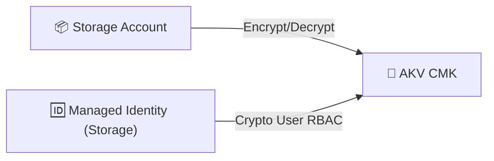

# 🟦 Day 2 — Azure Theory: Blob Storage with AKV Customer-Managed Keys

## 🧭 What you’ll learn
- Azure **Key Vault (AKV)** vs **Managed HSM**
- How Blob Storage uses **CMEK** (customer-managed keys)
- RBAC roles for data-plane crypto

## 🧠 Analogy: “Key Vault + Keycard”
AKV is the **vault** (holds CMK).  
The storage account presents a **keycard** (identity) to ask AKV to wrap/unwrap data keys.

🔑 Control model
Control-plane: Azure RBAC (Owner/Contributor)

Data-plane: AKV RBAC roles such as:

Key Vault Crypto User

Key Vault Crypto Service Encryption User (for services)

🧩 Required pieces
Key Vault with CMK (RSA or HSM-backed)

Managed Identity for Storage Account

Data-plane role assignment on the vault for that identity

Storage account configured with key URL

🧾 Audit
Activity Logs (control-plane) + KeyOperationResult (data-plane)

Enable soft delete + purge protection on AKV

✅ Checklist
Keep KV and Storage in compatible regions

Use RBAC authorization in AKV (--enable-rbac-authorization)

Private endpoints for AKV in production
