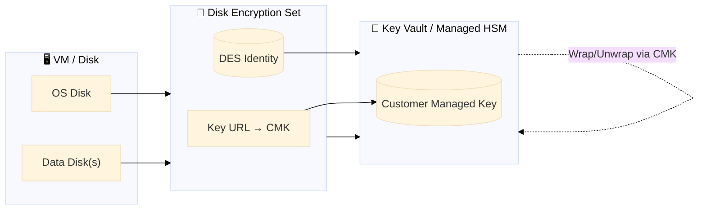
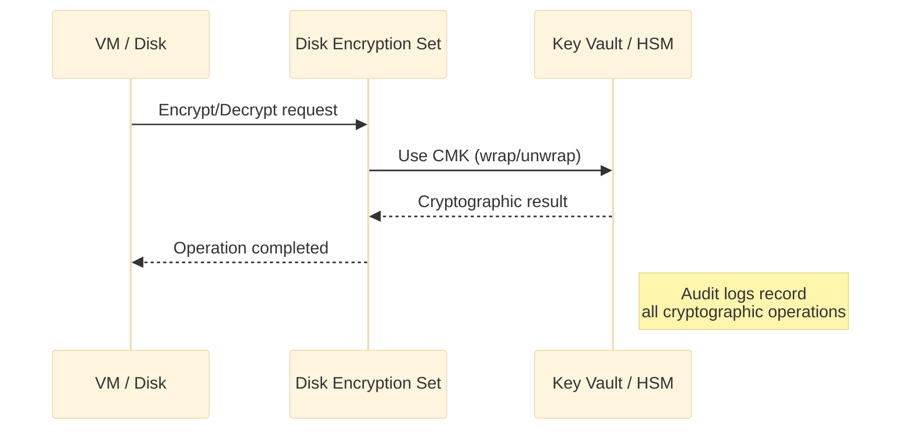

  

# 🟦 Day 5 — Azure Theory: Managed HSM vs Key Vault + Disk Encryption Sets (DES)
_Designing customer-managed encryption for Azure disks the right way._

---

## 🧭 The Big Picture

- **Key Vault (KV)**: multi-tenant service for **keys, secrets, certs**. Software-protected keys by default; HSM-backed available. Excellent general-purpose KMS.
- **Managed HSM (MHSM)**: **dedicated HSM cluster** (FIPS 140-2/3 L3). Highest assurance; larger throughput; HSM-only features. Costs more and has regional/quotas.

**Disk Encryption Set (DES)** is the **bridge**: a resource that *points to your CMK* (in KV or MHSM) and exposes an **identity** Azure Disks can use for encryption.

---

## 🧠 Mental Model — “Keycard & Vault”
- The **vault** (KV or MHSM) holds the **master key (CMK)**.
- The **DES** is the **keycard** referencing that CMK.
- **VM disks** present the keycard to the vault; the vault performs crypto and returns results. Keys **never** leave the vault.

🧩 Roles & Identities (What talks to whom?)
Azure uses RBAC (control-plane) + Crypto roles (data-plane) on the vault/HSM scope:

Actor	Needs Access To	Role (KV path)	Role (MHSM path)
DES resource identity (auto-created when DES is made)	KV or MHSM	Key Vault Crypto Service Encryption User	Managed HSM Crypto Service Encryption User
User-Assigned Identity you attach to DES (optional pattern)	KV or MHSM	Key Vault Crypto User	Managed HSM Crypto User
You (operator) to create keys / manage vault	KV or MHSM	Key Vault Administrator (or Owner)	Managed HSM Administrator

Tip: Many labs succeed by granting Crypto Service Encryption User to the DES principal at the vault/HSM scope.

🧱 DES Internals (What actually happens?)
You create a CMK in KV or MHSM (get its key URL).

You create a DES pointing to that key URL.

Azure assigns a managed identity to DES (principalId).

You grant that DES identity the Crypto Service Encryption User role on the vault/HSM scope.

Any disk (OS or data) bound to that DES is encrypted using the CMK behind the scenes.

Rotation: rotate the CMK (new version). The key URL remains stable; DES keeps working with the latest key version automatically.

🧰 When to choose MHSM vs KV?
Requirement	Choose
FIPS L3 boundary, dedicated HSM, isolation, high throughput	Managed HSM
Broad ecosystem features (secrets/certs), simpler ops, lower cost	Key Vault
Strict key sovereignty + external signer modules	MHSM (or External Key Mgmt in other clouds)

🔐 Policy Patterns You’ll Reuse
Least privilege: grant only Crypto Service Encryption User to the DES principal at the vault/HSM scope.

Split duties: operators (Admins) ≠ consumers (DES / disks).

Network controls: enable private endpoints on KV/MHSM; restrict by firewall.

Safety nets: enable soft delete + purge protection (KV); backup MHSM keys.

🧪 Verification Checklist (what to check in every environment)
DES shows a valid identity: identity.principalId exists.

The vault/HSM has a role assignment for that principal.

VM disks show “EncryptedWithCustomerKey” / DES ID bound.

You can disable the key (temporary) and observe failure → then enable and recover (don’t do in prod).

Key disabled/deleted → existing disks fail on operations; boot may fail.

Mixed auth models → use RBAC consistently (set enable_rbac_authorization=true for KV where possible).

Region mismatch → DES, vault/HSM, disks should be in compatible regions.

📝 Quick Review
Why does DES need its own identity even if your VM already has one?

Which single role on KV lets the DES principal perform encryption operations?

What breaks if you disable the CMK after DES is attached to disks?

One reason to pay for Managed HSM instead of Key Vault?

How does rotation work without re-provisioning disks?
