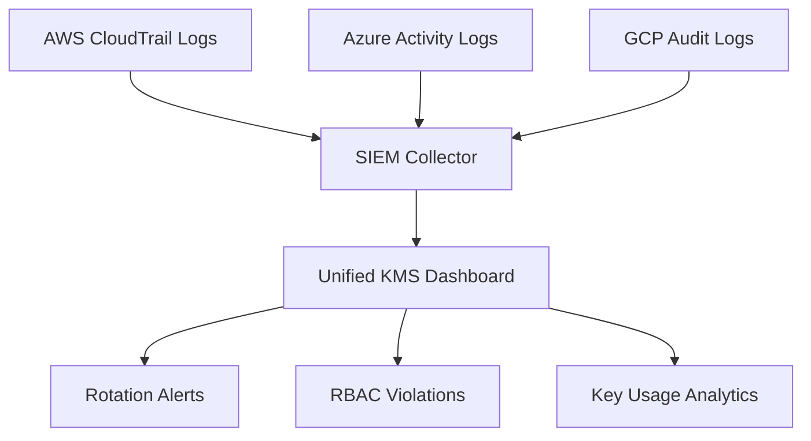

This is the culmination of your 10-day Cloud KMS Masterclass — a real-world simulation where AWS, Azure, and GCP encryption telemetry converge into a single governance view.
We’ll finish with both:

Theory: docs/cross-cloud/day10-theory.md

Lab: day-by-day/day10-capstone-dashboard.md


# ☁️ Day 10 — Unified Multi-Cloud KMS Security Dashboard (Capstone)


---

## 🎯 Objectives
- Build a **single security dashboard** for AWS KMS, Azure Key Vault, and GCP KMS  
- Correlate encryption activity, key rotation, and policy drift  
- Visualize audit events in a unified timeline  
- Deliver executive-level posture reporting

---

## 🧠 Analogy — “Air-Traffic Control for Encryption”
Each cloud is an aircraft (its own flight path).  
The dashboard is the **tower** watching all paths, ensuring keys rotate on schedule and no unauthorized “flights” enter restricted airspace.

---

## 🧩 Architecture Overview
| Component | Function | Example |
|------------|-----------|----------|
| **Data Ingest** | Pull logs & metrics | CloudTrail, Azure Monitor, Cloud Audit Logs |
| **Normalize** | Convert to OCSF/JSON schema | Lambda / Logic App / Cloud Function |
| **Store** | Central log bucket + SIEM index | S3, Storage Account, BigQuery Logs |
| **Visualize** | Correlate + Alert | Grafana / Power BI / Looker Studio |
| **Automate** | Remediation & rotation | EventBridge / Logic Apps / Pub/Sub Triggers |

---

## 🧮 Dashboard Data Model

🧾 Example Metrics to Track
Metric	Description	Threshold
🔑 Key Age	Time since last rotation	> 90 days = Alert
👥 RBAC Violations	Keys accessed by non-owners	> 0 = Critical
🧭 Envelope Depth	Nested encryption levels	> 3 = Investigate
🕒 Decrypt Events	Decrypts outside business hours	Anomaly
🪶 Audit Latency	Log delay > 2 min	Warning

⚙️ Integration Mechanisms
AWS → EventBridge → Lambda → S3 → Grafana

Azure → Monitor → Log Analytics → Power BI

GCP → Logging Sink → BigQuery → Looker Studio

Optional Chronicle / ELK SIEM for cross-cloud analytics

🧰 Policy as Dashboard (OPA + Terraform Cloud)
rego
Copy code
package kms.dashboard
violation[msg] {
  input.rotation_age_days > 90
  msg := sprintf("Key %s rotation overdue (%d days)", [input.id, input.rotation_age_days])
}
🧩 Visualization Design
Columns: Key ID | Cloud | Last Rotated | Usage Count | Violations | Owner
Colors: 🟢 Healthy / 🟡 Rotate Soon / 🔴 Overdue

🧮 Compliance Matrix
Framework	Dashboard Metric	Outcome
NIST 800-57	Key Lifecycle Mgmt	Auto-Rotation
ISO 27001 A.12	Event Monitoring	Unified Audit
PCI DSS 3.6	Access Logs	Continuous Visibility

🧭 Summary
The Capstone Dashboard transforms logs into governance.
Security teams can now see which cloud, which key, which user, when, and why — all in one pane of glass.

🏁 This concludes the Cloud KMS Masterclass Series.
Keep your keys rotating and your trust tight.

yaml
Copy code

Save (`Ctrl + O`, `Enter`, `Ctrl + X`).

---

## ⚙️ Step 2 — Create the Lab File
```bash
nano day-by-day/day10-capstone-dashboard.md
Paste:

markdown
Copy code
# ☁️ Day 10 Lab — Unified Multi-Cloud KMS Security Dashboard (Capstone)


---

## 🎯 Lab Goal
Build a lightweight dashboard that correlates AWS, Azure, and GCP KMS activity.

---

## 🧱 1. Environment Setup
```bash
mkdir -p dashboard/{aws,azure,gcp}
cd dashboard
🟧 2. AWS Collector
bash
Copy code
aws logs create-export-task \
  --task-name "KMSMetricsExport" \
  --log-group-name "/aws/kms/events" \
  --destination "securethecloud-siem" \
  --from "$(date -d '-1 hour' +%s)000" \
  --to "$(date +%s)000"
🟦 3. Azure Collector
bash
Copy code
az monitor activity-log list --status Succeeded \
  --query "[].{time:eventTimestamp,operation:operationName}" -o json > azure_kms.json
🟨 4. GCP Collector
bash
Copy code
gcloud logging read 'resource.type="kms_key" AND severity>=NOTICE' \
  --format json > gcp_kms.json
☁️ 5. Merge and Normalize
bash
Copy code
jq -s '[.[][]]' aws/*.json azure/*.json gcp/*.json > unified_kms_logs.json
⚙️ 6. Visualize with Grafana (Example)
Import JSON datasource → panel query:

sql
Copy code
SELECT cloud, key_id, count(*) as operations
FROM unified_kms_logs
GROUP BY cloud, key_id
🧩 7. Automate Rotation Reminders
Add Lambda/Logic App trigger when rotation_age > 90d.

✅ Validation
Logs ingested from all clouds

Key rotation alerts visible

Cross-cloud timeline rendered

🏁 Congratulations — you’ve built a unified multi-cloud KMS governance dashboard!
