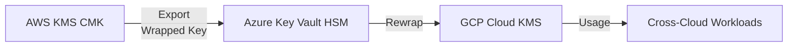

# ☁️ Day 7 — Cross-Cloud BYOK (AWS ↔ Azure ↔ GCP)

---

## 🎯 Objectives
- Understand *Bring Your Own Key* (BYOK) interoperability across major clouds  
- Export AWS KMS CMK to Azure Key Vault / GCP KMS using secure key material transfer  
- Implement shared trust anchors via **HSM wrapping**  
- Learn compliance considerations for multi-tenant encryption

---

## 🧠 Analogy
Imagine you’re transferring a **vault key** between three banks.  
Each bank uses a different lock format, so you wrap your key inside a tamper-proof envelope signed by your original bank’s HSM.  
Only the recipient bank can unwrap it securely.

---

## 🔐 BYOK Flow (Mermaid)

🧰 Tools & Formats
Platform	Key Export Format	Tool / CLI
AWS KMS	RSA 2048 + AES-KeyWrap	aws kms get-parameters-for-import
Azure Key Vault	PKCS#12 Bundle	az keyvault key import
GCP KMS	JSON Key Envelope	gcloud kms keys versions import
🧪 Hands-On Pattern

Generate export parameters in AWS KMS

Wrap the CMK using AWS-provided public key

Transfer to Azure HSM via secure channel

Re-wrap and import into GCP KMS for shared workloads

⚙️ Compliance Notes

Maintain HSM attestation chains

Log all BYOK transfers in CloudTrail, Azure Monitor, and Cloud Logging

Ensure FIPS 140-2 Level 3 for key material during transit

🧭 Summary

Cross-Cloud BYOK enables unified control and crypto sovereignty—your keys, your clouds.
This sets the stage for Day 8 — Envelope Encryption Deep Dive.
