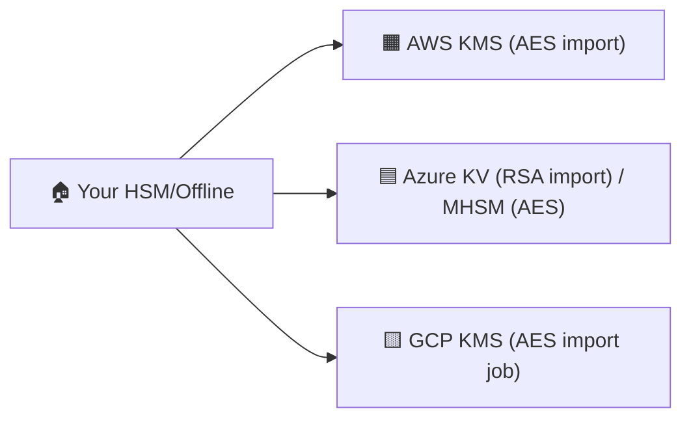

# ☁️ Day 7 — Theory: Cross-Cloud BYOK (AWS ↔ Azure ↔ GCP)

## 🧭 What you’ll learn
- Practical **BYOK** patterns that differ by cloud
- Reusing **AES-256** bytes in **AWS + GCP**; RSA import for **Azure KV**
- Governance: aliases, rotation rhythm, and audit unification

## 🧠 Mental model: “One Master, Three Doors”
You hold the **master key**; each cloud gets a compatible **door key**.

🔑 Reality matrix
Cloud	Typical BYOK	Same bytes as others?
AWS KMS	AES-256 import (EXTERNAL)	✅ with GCP
Azure Key Vault	RSA-2048/EC import	❌ (algo differs)
Azure Managed HSM	AES (oct-HSM)	⚠️ advanced
GCP KMS	AES-256 via Import Job	✅ with AWS
🧾 Governance handoff

Aliases/labels aligned: alias/byok/app-prod, app=prod

Rotation cadence (e.g., 90/180 days) per cloud, same calendar

Audit into one SIEM: CloudTrail + Activity Logs + Audit Logs

⚠️ Pitfalls

Expecting identical keys in all three clouds without MHSM

Region/key-version mismatches

Losing imported material ⇒ data unrecoverable
