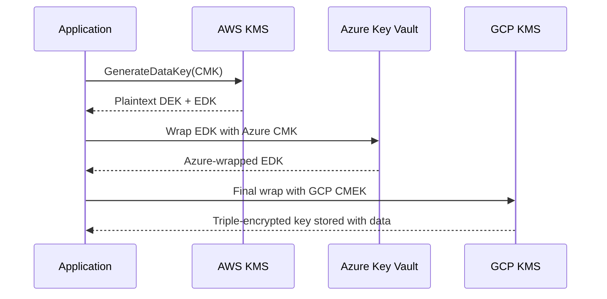

# ☁️ Day 8 — Cross-Cloud Envelope Encryption Deep Dive (with RBAC)

---

## 🎯 Objectives
- Understand **multi-layer envelope encryption**
- Map **RBAC** to encryption roles across AWS, Azure, and GCP
- Practice **rotation and re-wrapping** of envelope keys
- Visualize the “key within key” architecture

---

## 🧠 Analogy — *“The Diplomatic Pouch”*
Think of your data as a message carried in a **sealed pouch**.  
Inside it are **smaller envelopes**, each re-sealed by a trusted authority (AWS → Azure → GCP).  
Each courier can read its own label but cannot open the pouch itself.

---

## 🧩 Envelope Encryption Layers
| Layer | Key | Managed By | Description |
|-------|-----|-------------|-------------|
| 🔐 **Data Key (DEK)** | AES-256 | Application | Encrypts data locally |
| 🧱 **Envelope Key (EDK)** | CMK | Cloud KMS | Encrypts the DEK |
| 🏦 **Master Key (Root)** | HSM / BYOK | Org Security | Wraps the EDK for cross-cloud use |

---

## 🔄 Flow Diagram (Mermaid)

🧰 RBAC Alignment per Cloud

Cloud	    Role	                         Scope	                    Notes

AWS         kms:Encrypt, kms:Decrypt,            CMK policy + IAM           Fine-grained grants for EC2/Lambda
              kms:GenerateDataKey

Azure       Vault Crypto User /                   Data plane                RBAC must be enabled on vault
              Key Vault Crypto Officer

GCP          roles/cloudkms.cryptoKeyEncrypter     Key / Project            Service accounts mapped per dataset
                 Decrypter

🧾 Policy Mapping Example

AWS CMK Policy Snippet

{
 "Sid": "AllowLambdaEncryption",
 "Effect": "Allow",
 "Principal": {"Service": "lambda.amazonaws.com"},
 "Action": ["kms:Encrypt","kms:Decrypt","kms:GenerateDataKey"],
 "Resource": "*"
}

Azure Vault Role Assignment

az role assignment create \
 --assignee "<managed_identity_id>" \
 --role "Key Vault Crypto User" \
 --scope "/subscriptions/<subid>/resourceGroups/<rg>/providers/Microsoft.KeyVault/vaults/<vault>"

GCP IAM Binding

gcloud kms keys add-iam-policy-binding cmek-envelopes \
 --keyring global-secure --location=us-central1 \
 --member "serviceAccount:encryption-svc@caramel-pager-470614-d1.iam.gserviceaccount.com" \
 --role roles/cloudkms.cryptoKeyEncrypterDecrypter

🔁 Key Rotation Chain

Rotate the root key (HSM / BYOK).

Rewrap all envelopes (EDKs) under new root.

Data remains untouched; only key wrappers change.

Verify audit logs in each cloud.

🧮 Compliance Alignment
Framework	Requirement	Feature
NIST 800-57	Key hierarchy separation	DEK ≠ CMK ≠ HSM root
ISO 27001 A.10	Cryptographic control	RBAC + rotation
PCI DSS 3.6	Key rotation and storage	Envelope model supports
🧭 Summary

Envelope encryption with RBAC is the governance layer of cloud crypto — each service only decrypts its layer, and every unwrap is audited.
This ensures least privilege and traceability across AWS, Azure, and GCP.

Next → Day 9: “Key Governance, RBAC & Audit Automation”
