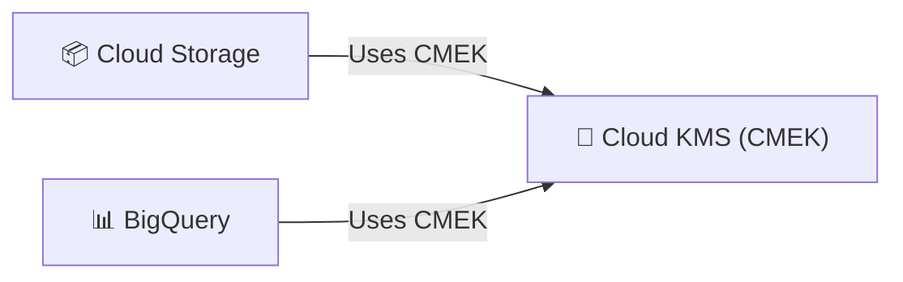

# 🟨 Day 3 — GCP Theory: CMEK for Cloud Storage & BigQuery

## 🧭 What you’ll learn
- **Cloud KMS** key ring / key / version model
- **CMEK** for Storage buckets and BigQuery datasets
- Roles, rotation, and audit logs

## 🧠 Analogy: “Library & Master Key”
The **key ring** is a shelf; each **key** is a book; each **version** is a new edition.  
Services borrow the book (CMK) to **wrap/unwrap** data keys.

🔑 Roles

roles/cloudkms.admin — manage rings/keys

roles/cloudkms.cryptoKeyEncrypterDecrypter — use for wrap/unwrap

Service agents for Storage / BigQuery need access to the key

🔁 Rotation

New key versions created on schedule; services pick latest

Old versions remain for decrypt

🧾 Audit

Cloud Audit Logs for KMS + services

Label keys (env=prod, app=…) for governance

✅ Checklist

Same location for bucket/dataset and KMS key

Grant least privilege to service accounts

Track key versions and rotation cadence
