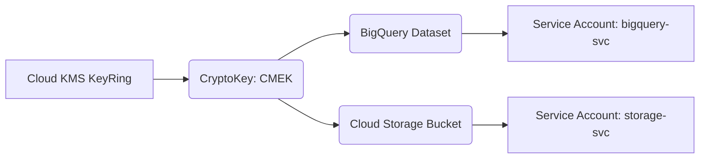

# 🟨 GCP Day 3 – CMEK + Cloud Storage + BigQuery Encryption

---

## 🎯 Goals
- Understand how Customer-Managed Encryption Keys (CMEK) integrate with GCP services  
- Encrypt Cloud Storage buckets and BigQuery datasets with CMEK  
- Use IAM to delegate KMS key usage across projects  
- Visualize CMEK hierarchy and key rotation

---

## 🧠 Concept Analogy
Think of **GCP KMS** as your digital vault.  
Each service (like BigQuery or Cloud Storage) checks out a **key badge** to access your encrypted boxes, but the master vault key never leaves KMS.  

[BigQuery Job] → [CMEK Reference] → [Cloud KMS KeyRing/Key] → [Envelope Encryption]

---

## 🔐 Core Components
| Layer | Description |
|-------|--------------|
| **KeyRing** | Logical group for keys |
| **CryptoKey** | Actual encryption key (CMEK) |
| **IAM Policy** | Controls who can use or rotate the key |
| **Service Agent** | The identity BigQuery or Cloud Storage uses under the hood |

---

## 🧩 Architecture Flow (Mermaid)

🧪 Example CLI Setup

gcloud kms keyrings create secure-ring \
  --location=us-central1

gcloud kms keys create cmek-demo \
  --location=us-central1 --keyring=secure-ring \
  --purpose=encryption

# Bind IAM roles for BigQuery & Storage
gcloud kms keys add-iam-policy-binding cmek-demo \
  --keyring=secure-ring --location=us-central1 \
  --member=serviceAccount:service-${PROJECT_NUM}@gs-project-accounts.iam.gserviceaccount.com \
  --role=roles/cloudkms.cryptoKeyEncrypterDecrypter

🔁 Rotation + Audit

Enable key rotation with:

gcloud kms keys update cmek-demo \
  --location=us-central1 --keyring=secure-ring \
  --rotation-period=90d --next-rotation-time=$(date -u -d '90 days' +%Y-%m-%dT%H:%M:%SZ)

🧭 Summary

CMEK centralizes key control across multiple GCP services—BigQuery, GCS, Pub/Sub—while maintaining separation of duties through IAM.

It’s the foundation for Cross-Cloud BYOK (Day 7).
