  

# 🟨 Day 6 — GCP Theory: External Key Manager (EKM) & Sovereign Encryption  
_"Your keys, your jurisdiction — the cloud only borrows them."_

---

## 🧭 The Big Picture
Traditional **Customer-Managed Encryption Keys (CMEK)** give you control **inside GCP**.  
**External Key Manager (EKM)** takes that control **outside of GCP** — to your own HSM, on-premise appliance, or external SaaS key provider.

With EKM:
- Key material **never resides in Google Cloud**.
- GCP performs **encryption/decryption operations** via a **secure outbound API call**.
- You get **full audit visibility**, **independent rotation**, and **policy sovereignty**.

> EKM is a key sovereignty technology — critical for financial, healthcare, and government workloads.

---

## 🧠 Analogy — “The Cloud’s Safe Deposit Box”

Imagine Google Cloud as a **bank**.  
- You have a **safe deposit box** inside the bank (your storage).  
- The **bank** (GCP) can help store your valuables (data).  
- But the **key to that box** stays on your keychain — **only you** can open or close it.

That’s EKM: the cloud provides the vault, **you own the key**.

```mermaid
%%{init: {'theme':'base'}}%%
flowchart LR
  User["👩‍💻 You (Key Owner)"]
  ExtHSM["🏦 External HSM / KMS"]
  EKMConn["🔗 EKM Connection (API Layer)"]
  GCP["☁️ GCP KMS / Services"]
  Storage["📦 Cloud Storage / BigQuery / VM Disk"]
```

  Storage -->|"Encrypt request"| GCP
  GCP -->|"Proxy call"| EKMConn
  EKMConn -->|"Sign/Decrypt"| ExtHSM
  ExtHSM -. "No key material leaves" .-> User
  GCP -. logs .-> Audit[(Cloud Audit Logs)]
🧩 EKM Architecture Components
Component	Description
External Key (EXTERNAL)	Key metadata object in Cloud KMS that references an external key.
EKM Connection	Secure connector configuration (endpoint, protocol, auth mode).
External Key Manager (host)	Your HSM, key appliance, or trusted vendor service.
Service Account	Authenticated principal for Cloud KMS to access the external host.
Audit Pipeline	Logs from both GCP and external key provider for complete traceability.

🔐 Key Protection Levels in Cloud KMS
Level	Description	Managed By
SOFTWARE	Keys encrypted in software, stored in Google’s infrastructure.	Google
HSM	Keys stored and used inside Google-managed HSM.	Google
EXTERNAL	Key lives in your own environment; only a reference stored in GCP.	You

🧱 Security & Control Flow
A GCP service (e.g., BigQuery) requests encryption using a CMEK-referenced key.

The CMEK metadata points to an External Key object.

Cloud KMS contacts the EKM connection endpoint via secure TLS.

The external key host performs the cryptographic operation (wrap/unwrap, sign/decrypt).

Only the result returns — key material never enters GCP.

Every call is logged in both:

Cloud Audit Logs (in GCP)

External Key Provider logs (in your domain)

🧰 Common EKM Providers
Thales CipherTrust (HSM + EKM)

Fortanix DSM / EDP

HashiCorp Vault with EKM plugin

Utimaco, Entrust, Unbound Security

Custom REST-based on-prem EKM server

You can run your own EKM endpoint for lab simulation or testing sovereignty policies.

🌐 Compliance and Regulatory Impact
Framework	EKM Benefit
GDPR / Schrems II	Ensures encryption keys remain under EU control.
PCI DSS 4.0	Key custody separation for cardholder data.
FedRAMP / CJIS	On-prem or sovereign boundary for key storage.
HIPAA	Patient data encryption managed under healthcare org’s control.
Financial Regulations (e.g., MAS, OCC)	Enforces local jurisdiction over encryption material.

🔍 IAM & Access Control Overview
Role	Description
roles/cloudkms.admin	Create key rings, keys, and EKM connections.
roles/cloudkms.signerVerifier	Allows cryptographic operations using the key.
roles/cloudkms.viewer	View keys and their configuration.
External system identity	Authenticated endpoint for EKM (usually service account key).

🧩 Diagram — Dual-Audit Pattern
mermaid
Copy code
%%{init: {'theme':'base'}}%%
sequenceDiagram
  participant GCP as GCP Service
  participant KMS as Cloud KMS
  participant EKM as EKM Connection
  participant HOST as External Key Host
  participant AUDIT as Audit Systems

  GCP->>KMS: Request Encrypt()
  KMS->>EKM: Forward request (HTTPS/TLS)
  EKM->>HOST: Execute cryptographic op
  HOST-->>EKM: Return wrapped data key
  EKM-->>KMS: Response
  KMS-->>GCP: Encrypted output
  KMS->>AUDIT: Log Cloud Audit Event
  HOST->>AUDIT: Log Local Key Access
🧠 Design Considerations
✅ Latency vs sovereignty
 - EKM adds ~10–50 ms latency per operation, but gives jurisdictional control.

✅ Failover design
 - EKM host downtime → encryption fails. Implement fallback or redundancy.

✅ Hybrid pattern
 - Mix CMEK (Google-managed vault) for general workloads, EKM for regulated data.

✅ Rotation & revocation
 - Controlled at external host; rotate or disable externally.

✅ Billing note
 - EKM usage counts as KMS API calls + possible egress from Google network.

🧩 EKM vs CMEK Quick Reference
Attribute	CMEK	EKM
Key stored in	Cloud KMS (Google HSM)	Your external system
Who owns key material	Google-managed	You
Who rotates	You (inside GCP)	You (outside GCP)
Supported services	Most GCP services	Subset (BigQuery, GCS, Compute)
Best for	Standard control	Sovereign compliance

⚠️ Common Pitfalls
EKM connection endpoint unreachable → operations fail.

Key material accidentally cached → ensure TLS & caching policies.

Missing IAM role for KMS service account → handshake denied.

Forgetting dual-logging → regulatory audits incomplete.

🧩 The Trust Boundary Diagram
mermaid
Copy code
%%{init: {'theme':'base'}}%%
flowchart TB
  subgraph External["🔒 External Control Zone (Your Org / On-prem / Partner)"]
    KHost["External HSM / KMS"]
    AuditExt["External Audit Logs"]
  end
  subgraph GCP["☁️ Google Cloud Zone"]
    CKMS["Cloud KMS Key Metadata"]
    Svc["BigQuery / Storage / Compute"]
    AuditGCP["Cloud Audit Logs"]
  end
  Svc --> CKMS
  CKMS -->|"HTTPS (EKM Connection)"| KHost
  KHost --> AuditExt
  CKMS --> AuditGCP
  style External fill:#fefce8,stroke:#fde047,stroke-width:2px
  style GCP fill:#ecfeff,stroke:#38bdf8,stroke-width:2px
🧠 Quick Review
What does “protectionLevel=EXTERNAL” mean in Cloud KMS?

Which two logs together complete the audit trail for EKM operations?

Name two compliance frameworks where EKM provides sovereignty guarantees.

What happens to a GCP encryption operation if your external key host is offline?

Why is latency slightly higher with EKM compared to CMEK?

💬 “Control of data without control of keys is only an illusion of security.”
— CloudLab KMS Masterclass
